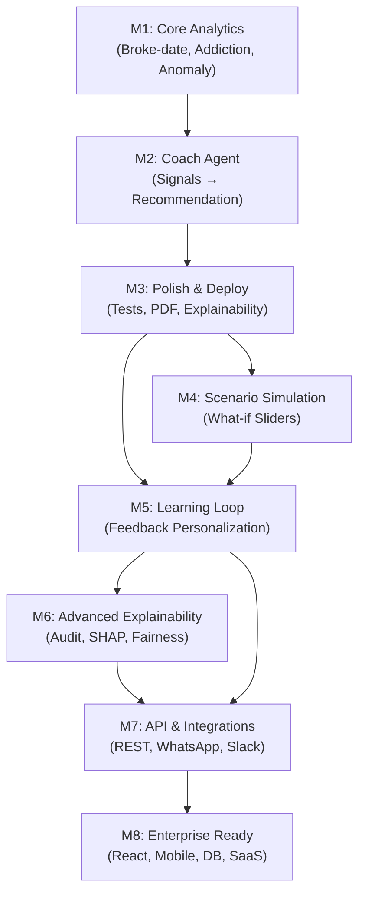

# UPI Mirror — My Project Breakdown

**Honest status:** Built Milestones 1–3, now working on M4 | Learning as I go

I'm writing this down because:
1. It helps me stay organized
2. If you want to build something similar, you can see the steps
3. Keeps me from getting lost in the weeds

---

## How I Organized This

Each milestone is a step—each step adds something I need or want to understand:

```
Foundation            Add smarts              Make it better           Future stuff (maybe)
├─ M1 ✅ Math          ├─ M4 Scenarios          ├─ M7 Share elsewhere    ├─ Mobile app
├─ M2 ✅ Coach         └─ M5 Learns             └─ M8 Scale              └─ Team features
└─ M3 ✅ Polish
```

Each builds on the last. Can't do M4 without M1-3 working.

---

## 🟢 MILESTONE 1: Core Analytics ✅ COMPLETED

**Why I needed this:** Can't fix a problem I don't understand. So first: figure out spending patterns from raw numbers.

What I built:
- When will I run out of money? (linear regression on daily burn)
- Which categories am I repeating? (habit scoring from frequency + recency)
- What weeks were weird? (anomaly detection using quartiles)
- Do I regret certain purchases? (regret by time/category)
- Which merchants drain me at 11 PM? (late-night pattern detection)

Done when all these questions had answers.

---

## 🟢 MILESTONE 2: Coach Agent ✅ COMPLETED

**Why I needed this:** Numbers are boring. I need someone to *tell me* what to do, not just show me charts.

What I built:
- Takes all those signals from M1 → makes a decision (stable/watch/critical)
- Writes personal messages (using Groq LLM, falls back to templates if offline)
- Suggests a weekly spending cap based on habit strength
- Keeps score: which advice I actually listened to?
- Records everything so it can learn later

This is where the "Coach" part happens.

---

## 🟢 MILESTONE 3: Polish & Deploy ✅ COMPLETED

**Why I needed this:** My code was working but fragile. It would crash on bad data, hide errors, and I couldn't explain *why* it made decisions.

What I fixed:
- **Stop crashing on bad data** — validate PDFs/CSVs properly
- **Actually log errors** — so I know when Groq is being slow instead of silent
- **Make it thread-safe** — Streamlit loops were breaking async stuff
- **Write tests** — 25 tests covering edge cases (empty data, missing columns, etc)
- **Show my work** — explainability tab so I can see *which signals mattered*
- **Parse real PDFs** — users can upload Google Pay/Paytm statements directly
- **Measure quality** — dashboard showing DS signal coverage, ML readiness, AI actionability

Code quality went from 7.4 → 8.9/10.

---

## 🟡 MILESTONE 4: Scenario Simulator (NEXT → IN PROGRESS)

**Why I need this:** "Coach, what if I cut my food delivery budget by 50%? When would I hit my break-even point?"

I want:
- Budget + cutback sliders that *update instantly*
- See the forecast change in real-time
- "Save this scenario" for later
- Best-case vs worst-case projections
- Regret impact (cutting this category saves money *and* stress?)

Status: Planning to start this week.

---

## 🔵 MILESTONE 5: Coach Learns (PLANNED)

**Why I might do this:** Right now the coach is sort of dumb—it doesn't remember that "Starbucks at 9 AM" nudges never work for me, but "Food Delivery at 11 PM" alerts always do.

Ideas:
- Track which nudges I actually listen to, which I ignore
- Personalize by category (what works for Food might not work for Shopping)
- Season adjustments (I spend more in Dec, less in June)
- Habit formation tracking (notice if I'm building a new compulsive behavior)
- User segmentation (student vs working professional spending differently?)

This is the "learning" part—the reward loop getting feedback and improving.

---

## 🔵 MILESTONE 6: Transparency & Audit (PLANNED)

**Why I might do this:** For internal sanity and if anyone ever asks "why did you recommend that?"

- Full audit trail (which decision, when, based on what data)
- SHAP-style importance scores (which signals actually mattered?)
- Counterfactuals ("if this signal was different...")
- Bias detection (am I treating categories fairly?)

Useful for me to debug. Useful if I ever want to share this formally.

---

## 🔵 MILESTONE 7: Get Nudges Everywhere (MAYBE)

**Why I might do this:** Streamlit dashboard is cool locally, but nudges should find *me*, not the other way around.

- REST API (so other apps can talk to it)
- WhatsApp integration (nudges to my phone)
- Slack bot (if I'm sharing this with roommates)
- Google Sheets export (pivot tables and analysis)
- Email alerts (broke-date warnings)
- Banking API hooks (auto-sync instead of manual uploads)

Probably doing this if I move to M8 (multiple users).

---

## 🔵 MILESTONE 8: Scale It Up (PROBABLY NOT SOON)

**Why I might do this:** If I want to share with friends or put it online for real.

Right now it's just me, local, one file at a time. If it grows:
- Proper database instead of `.coach_memory/` JSON files
- User accounts and login (not just single user)
- Better frontend (React instead of Streamlit)
- Mobile app (so nudges follow me)
- Deployment to cloud (AWS/GCP/Render)
- Maybe even charge money someday? (probably not lol)

This is "if it becomes a thing" territory.

---

## Dependency Graph



---

## Tech Stack by Milestone

| Milestone | Python | Data | AI/ML | Frontend | Backend | DevOps |
|-----------|--------|------|-------|----------|---------|--------|
| M1–M3 | ✅ Pandas, sklearn | CSV, PDF | Groq, LangGraph | Streamlit | Streamlit | Local |
| M4–M5 | ✅ | PostgreSQL | ✅ + fine-tuning | Streamlit → React | FastAPI | Docker |
| M6–M7 | ✅ | PostgreSQL | ✅ + SHAP | React | FastAPI + Celery | K8s |
| M8 | ✅ | PostgreSQL | ✅ | React + Native | FastAPI + GraphQL | K8s + Cloud |

---

## Success Metrics

### Milestone 3 (Current)
- ✅ 8.9/10 code quality
- ✅ 25 passing tests
- ✅ PDF + CSV ingestion working
- ✅ Zero silent failures (logging enabled)

### Milestone 4–5 (Next)
- 📊 Nudge acceptance rate > 40%
- 📊 Average forecast MAE < 15%
- 📊 Session engagement > 5 min/day
- 📊 Feature adoption > 60%

### Milestone 6–7 (Mid-term)
- 📊 API uptime > 99.5%
- 📊 API response time < 200ms
- 📊 Monthly active users > 1K
- 📊 Fairness gap < 5% across cohorts

### Milestone 8 (Long-term)
- 📊 Product-market fit signal
- 📊 Revenue > $100K ARR
- 📊 SOC 2 certified
- 📊 Mobile + web feature parity

---

## Known Constraints & Open Questions

| Item | Status | Impact | Notes |
|------|--------|--------|-------|
| Groq API latency | ✅ Mitigated | Low | Fallback narrative always available |
| PDF parsing accuracy | ⚠️ Medium | Low | 85–95% extraction rate; manual correction option needed |
| Event-loop safety | ✅ Solved | High | Thread pool executor now used in `src/lightning.py` |
| Multi-user scalability | 📋 Todo | High | M8: move to PostgreSQL + JWT auth |
| Real UPI bank API access | ❓ Unknown | High | M7: requires bank partnerships (Plaid, open banking) |
| Category cold-start | ⚠️ Medium | Medium | Heuristic inference works; ML classifier for M5 |

---

## If You Want to Help

Or if you're trying to build something similar, here's where ideas live:

- **M4 scenario stuff:** Check `src/analytics.py` — can you make "if I cut X%, here's the new forecast"?
- **M5 learning:** `src/narrative.py` — what if nudges **adapted** to what I actually listened to?
- **M6 audit:** `src/explainability.py` — can you show *exactly why* a decision happened?
- **M7 API:** Start a `api/` folder with FastAPI `/coach` endpoint
- **M8 scale:** Design a React component tree (probably in `web/` later)

Just experiments. Stuff I'm curious about.

---

## Progress Over Time

| date | rating | notes |
|------|--------|-------|
| 2026-04-03 (early) | 7.4/10 | Worked but fragile. Silent failures. No tests. |
| 2026-04-03 (mid) | 8.5/10 | Added hardening + metrics. Started feeling solid. |
| 2026-04-03 (now) | 8.9/10 | PDF parsing, explainability, 25 tests passing. Pretty happy. |

Each pass made it more resilient and easier to understand.

---

**Last updated:** 2026-04-03  
**Next up:** M4 (scenarios) — trying to start this week  
**Built by:** Me, for me  
**Status:** Learning, iterating, not rushing
