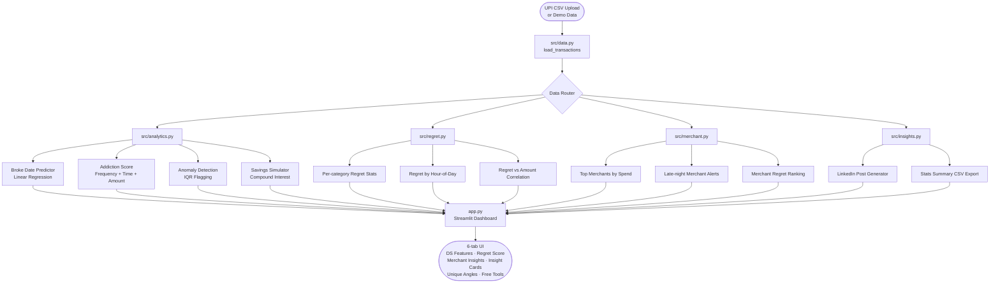

<div align="center">

# 🪞 UPI Mirror

### *The student money shame bot — but actually useful.*

> "I was a broke student who didn't know where the money was going.  
> So I built a model that predicted my broke date 12 days out — accurate to within 2 days.  
> Now I know exactly when to stop ordering Zomato."

[](https://python.org)
[](https://streamlit.io)
[](https://scikit-learn.org)
[](LICENSE)

**Built by [Yashaswini V](https://github.com/Yashaswini-V21)**

</div>

---

## Why I Built This

Most finance apps show you charts. They show you *what* happened. They never tell you *when* you'll be broke, *which* habits are becoming compulsive, or *why* you feel regret after every late-night Swiggy order.

I was that broke student. ₹18,000 budget. Gone by the 22nd. No idea why.

So I built UPI Mirror — a brutally honest spending analyser that turns raw UPI transaction data into behavioural insights using real data science: linear regression, IQR anomaly detection, and addiction scoring. Personal pain → real product.

---

## What It Does

| Feature | What it tells you |
|---|---|
| **Broke Date Predictor** | "At this rate, you'll hit your budget limit by March 22." Linear regression on daily cumulative spend. |
| **Spending Addiction Score** | 0–100 score per category based on frequency, time consistency, amount growth, and late-night share. |
| **Weekly Anomaly Detection** | IQR-based spike flagging. "This week's food spend is 2.8 standard deviations above normal." |
| **Savings Simulator** | Cut Swiggy by 30% + 6% FD interest → ₹18,400 saved in 12 months. Compound interest in one chart. |
| **Category Regret Score** | Rate regret 1–5 per category. Correlate regret vs amount vs time-of-day. |
| **Merchant Insights** | Flag merchants where 30%+ orders are placed after 10 PM. Late-night spend breakdown. |
| **Shareable Insight Cards** | Auto-generate a LinkedIn post from your own data. Blurred numbers — safe to post publicly. |

---

## Data Flow



---

## Project Structure

```
UPI-Mirror/
├── app.py                  # Streamlit entrypoint — all tabs wired here
├── requirements.txt        # Pinned dependencies
└── src/
    ├── data.py             # CSV loader + 90-day demo data generator
    ├── analytics.py        # Broke-date, addiction score, anomaly, savings
    ├── regret.py           # Category regret stats, hour/amount correlation
    ├── merchant.py         # Top merchants, late-night alerts, regret ranking
    ├── insights.py         # LinkedIn card generator, CSV export
    └── ui.py               # Streamlit styles, hero card, component helpers
```

---

## Quickstart

```bash
# Clone
git clone https://github.com/Yashaswini-V21/UPI-Mirror.git
cd UPI-Mirror

# Install
python -m venv .venv
.venv\Scripts\activate          # Windows
pip install -r requirements.txt

# Run
streamlit run app.py
```

Open [http://localhost:8501](http://localhost:8501) — demo data loads automatically, no CSV needed.

---

## CSV Schema

Upload your own UPI data with this format:

```csv
datetime,amount,category,merchant,regret
2026-03-01 20:15:00,320.0,Food Delivery,Zomato,4
2026-03-02 09:30:00,180.0,Cafe,Blue Tokai,2
```

| Column | Type | Required |
|--------|------|----------|
| `datetime` | `YYYY-MM-DD HH:MM:SS` | ✅ |
| `amount` | float (Rs.) | ✅ |
| `category` | string | ✅ |
| `merchant` | string | ✅ |
| `regret` | int 1–5 | ⬜ optional |

---

## Tech Stack

| Tool | Purpose |
|------|---------|
| **Pandas** | Data wrangling and aggregations |
| **Scikit-learn** | Linear regression for broke-date prediction |
| **Streamlit** | Interactive dashboard UI |
| **Plotly** | Charts — line, bar, scatter, area |
| **NumPy** | Numerical support |

Everything is free and open source. No API keys. No database. Just your own UPI data.

---

## Standout Interview Angle

> *"I built UPI Mirror because existing apps showed me charts but never predicted when I'd go broke. I needed a model that shamed me into changing."*
>
> Personal pain → product insight → FinTech interview gold.

**At PhonePe or Cred:** this project demonstrates end-to-end data science thinking — feature engineering from raw transactions, regression modelling, behavioural scoring, and a deployable product — all from real personal data.

---

<div align="center">

Made with personal pain by **[Yashaswini V](https://github.com/Yashaswini-V21)**

*If this resonated, star the repo ⭐ and build your own version.*

</div>
