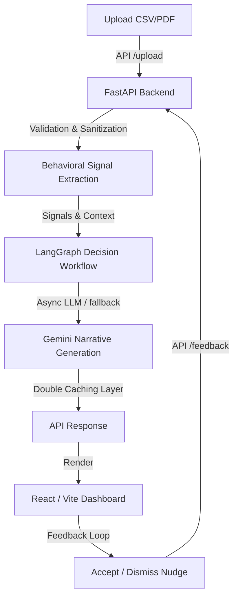

<div align="center">


[](#status)
[](#tech-stack)
[](#tech-stack)
[](#tech-stack)
[](#system-architecture)
[](#license)

<strong>A production-grade behavioral finance intelligence platform that predicts spending anomalies, tracks habits, and delivers personalized nudges via multi-channel delivery.</strong>

</div>

---

## Contents

- [1) Product Overview](#1-product-overview)
- [2) Key Differentiators](#2-key-differentiators)
- [3) System Architecture](#3-system-architecture)
- [4) Repository Structure](#4-repository-structure)
- [5) Quickstart Guide](#5-quickstart-guide)
- [6) Core Backend Modules](#6-core-backend-modules)
- [7) Security & Hardening](#7-security--hardening)
- [8) Observability & Monitoring](#8-observability--monitoring)
- [9) Data Governance & PII Protection](#9-data-governance--pii-protection)
- [10) Testing & Quality Assurance](#10-testing--quality-assurance)
- [11) License](#11-license)

---

## 1) Product Overview

Kira-AI addresses pre-failure behavioral detection by converting messy UPI payment history (from Google Pay, Paytm, and PhonePe) into actionable financial foresight.

- **Foresight Engine**: Calculates **broke-date forecasting** via linear regression on daily burn rates to warn users before they run out of money.
- **Behavioral Signal Extraction**: Generates **habit scores** based on recency + frequency to isolate compulsive spending loops.
- **Smart Decision Agent**: Integrates a stateful **LangGraph agent** that fuses signals (regret score, late-night spending, anomaly spikes) into a risk level (`stable`, `watch`, `critical`).
- **Feedback & Optimization Loop**: Saves accepted/dismissed nudge responses as a reward signal, enabling future personalization and optimization.

---

## 2) Key Differentiators

Most finance apps only show you past categories (what happened). Kira-AI answers "when will I overrun" and "what must be done right now".

| Capability | Typical Expense Tracker | Kira-AI |
|---|---|---|
| **Forecasting** | Static historical totals | Broke-date and projected month-end risk |
| **Behavioral Layer** | Category graphs | Habit intensity, anomaly routing, regret context |
| **Interventions** | Passive notifications | Daily nudge + dynamic weekly cap recommendations |
| **Learning Loop** | No user signal | accepted/dismissed feedback loop |
| **Aesthetics** | Generic dashboards | Sleek dark glassmorphism, smooth Framer Motion animations |

---

## 3) System Architecture

Kira-AI uses a decoupled Architecture: a responsive, premium React frontend communicating with an asynchronous, hardened FastAPI backend.



---

## 4) Repository Structure

The codebase is organized cleanly into backend analytics, FastAPI routing, and the React client application:

```text
Kira-AI/
├── api/                     # FastAPI Router and Endpoint Layer
│   ├── main.py              # Main app initialization (lifespan manager, middleware)
│   ├── schemas.py           # Pydantic schemas for request/response
│   └── security.py          # API Token verification, signature check, file validator
├── src/                     # Core Business Logic & Enterprise Modules
│   ├── analytics.py         # Broke-date forecasting & weekly anomalies
│   ├── audit.py             # Immutable append-only audit trail
│   ├── coach_agent.py       # LangGraph spending coach agent
│   ├── coach_memory.py      # Local snapshot persistence
│   ├── data.py              # Transaction loading and cleaning
│   ├── data_governance.py   # Data retention, session caps & PII masking
│   ├── delivery.py          # WhatsApp/Email communication formatting
│   ├── merchant.py          # Late-night payment analytics
│   ├── narrative.py         # Gemini narrative generation with fallback
│   ├── observability.py     # Prometheus metrics & structlog setup
│   ├── pdf_parser.py        # UPI statement PDF parser
│   ├── regret.py            # Regret tracking and time correlation
│   └── resilience.py        # Caching layers and pybreaker circuit breakers
├── web/                     # React Frontend Application (Vite + TS)
│   ├── src/
│   │   ├── components/      # UI components (GlassCard, KiraButton, Tabs)
│   │   ├── hooks/           # useCountUp, useTypewriter, etc.
│   │   ├── store/           # Zustand global state management
│   │   └── styles/          # Modern global & animation stylesheets
│   ├── package.json
│   └── vite.config.ts
├── tests/                   # Test Suite
│   ├── test_api.py          # Endpoint integration tests
│   ├── test_coach_agent_unit.py
│   └── test_comprehensive.py
├── requirements.txt         # Python dependencies
└── Makefile                 # Build and test shortcuts
```

---

## 5) Quickstart Guide

### Prerequisite Setup

Ensure Python 3.11+ and Node.js 18+ are installed.

#### 1. Running the Backend API
1. Create and activate a Python virtual environment:
   ```bash
   python -m venv .venv
   .venv\Scripts\activate      # Windows
   source .venv/bin/activate    # macOS/Linux
   ```
2. Install Python dependencies:
   ```bash
   pip install -r requirements.txt
   ```
3. Copy `.env.example` to `.env` and fill out your variables (e.g., `GEMINI_API_KEY`).
4. Start the FastAPI development server:
   ```bash
   uvicorn api.main:app --reload --port 8000
   ```
   The backend API is now running at `http://localhost:8000`. You can access documentation at `http://localhost:8000/docs`.

#### 2. Running the React Frontend
1. Navigate to the frontend directory:
   ```bash
   cd web
   ```
2. Install Node packages:
   ```bash
   npm install
   ```
3. Run the Vite development server:
   ```bash
   npm run dev
   ```
   Open `http://localhost:5173` to view the application.

---

## 6) Core Backend Modules

- **Broke Date Predictor (`src/analytics.py`)**: Runs linear regression on cumulative daily spend to forecast when the user crosses their budget line.
- **Coach Agent (`src/coach_agent.py`)**: Stateful workflow that determines status, suggests a spending limit, and designs target-oriented nudges.
- **Resilience Engine (`src/resilience.py`)**: Employs circuit breakers to avoid hammering downstream endpoints (Gemini, Twilio) during network disruptions.
- **Data Governance (`src/data_governance.py`)**: Controls PII masking and enforces strict data retention periods.

---

## 7) Security & Hardening

Kira-AI uses multi-layered protection patterns:
- **HMAC Signatures**: Supports verification of `X-Kira-Signature` headers to defend endpoints from request manipulation.
- **Constant-Time Verification**: Bearer tokens are evaluated using `hmac.compare_digest` to eliminate timing attack profiles.
- **CSV Injection Prevention**: Strips common formula triggers (`=`, `@`, `+`, `-`) from user transaction fields before storing.
- **Strict File Ingestion**: Enforces limits on upload file size (<5MB), magic bytes (PDF check), and schema structure (CSV columns).

---

## 8) Observability & Monitoring

Observability is fully integrated into the backend runtime:
- **Structured JSON Logs**: Handled via `structlog` for easy parsing by ELK or CloudWatch. Includes correlation IDs (`X-Request-ID`).
- **Prometheus Metrics**: Tracks HTTP request volumes, processing latencies, active sessions, and cache hits.
- **OpenTelemetry Tracing**: Exposes lifecycle spans for profiling database operations and LLM requests.

---

## 9) Data Governance & PII Protection

To protect user confidentiality:
- **PII Hashing**: Hashes payee and merchant strings using SHA-256 before disk writes.
- **Automatic Cleanup**: Stale transactions are auto-purged if they exceed `DATA_RETENTION_DAYS`.
- **Session Cap Limits**: Limits concurrent cached files to prevent session storage memory overflow.

---

## 10) Testing & Quality Assurance

FastAPI endpoints and business logic are covered by a comprehensive test suite.

Run pytest:
```bash
python -m pytest tests/ --cov=src --cov=api --cov-report=term
```

All integration flows (Upload -> Coach -> Feedback) are fully tested and output a clean coverage summary.

---

## 11) License

This project is licensed under the MIT License. See [LICENSE](LICENSE) for details.
