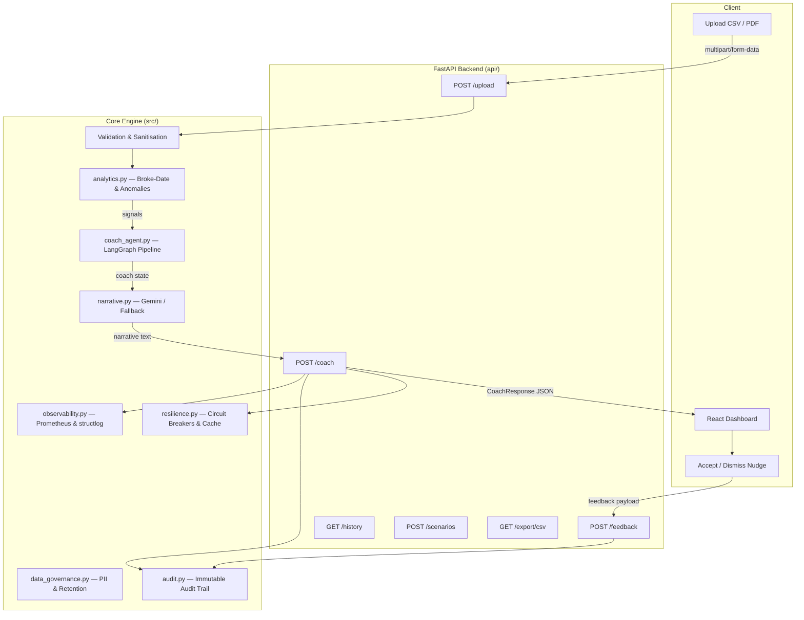

<div align="center">


[](https://python.org)
[](https://fastapi.tiangolo.com)
[](https://reactjs.org)
[](https://langchain-ai.github.io/langgraph/)
[](LICENSE)
[](https://github.com)

<p align="center">
  <strong>A production-grade behavioral finance intelligence platform that converts UPI payment history into predictive spending insights, habit scores, and personalised AI-generated nudges — all via a hardened FastAPI backend and a sleek React dashboard.</strong>
</p>

</div>

---

## Table of Contents

1. [Product Overview](#1-product-overview)
2. [Key Differentiators](#2-key-differentiators)
3. [System Architecture](#3-system-architecture)
4. [Repository Structure](#4-repository-structure)
5. [Quickstart Guide](#5-quickstart-guide)
6. [API Reference](#6-api-reference)
7. [Backend Modules](#7-backend-modules)
8. [Security & Hardening](#8-security--hardening)
9. [Observability & Monitoring](#9-observability--monitoring)
10. [Data Governance & PII Protection](#10-data-governance--pii-protection)
11. [Testing & Quality Assurance](#11-testing--quality-assurance)
12. [Deployment](#12-deployment)
13. [Contributing](#13-contributing)
14. [License](#14-license)

---

## 1) Product Overview

Kira-AI solves **pre-failure behavioral detection** — the gap between noticing a bad habit and acting on it before the bank balance hits zero.

It ingests messy UPI payment history (CSV exports from Google Pay, Paytm, PhonePe, or directly parsed PDFs) and produces:

| Output | What it does |
|---|---|
| **Broke-Date Forecast** | Linear regression on daily burn rate predicts which day you run out of money |
| **Habit Scores** | 0–100 addiction intensity per category derived from frequency, late-night share, weekly consistency, and trend |
| **Anomaly Detection** | IQR-based weekly spend spikes flagged with severity score |
| **AI Nudge** | Gemini-powered 3-sentence coaching narrative with a concrete rupee target and time window |
| **Feedback Loop** | Accepted / dismissed nudge responses stored as reward signals for future personalisation |
| **What-If Scenarios** | Simulate the days-gained from cutting any category by X% |

---

## 2) Key Differentiators

Most finance apps only show you **what happened**. Kira-AI answers *when will I overrun* and *what must I do right now*.

| Capability | Typical Expense Tracker | **Kira-AI** |
|---|---|---|
| **Forecasting** | Static historical totals | Broke-date and projected month-end risk |
| **Behavioral Layer** | Category pie charts | Habit intensity, anomaly routing, regret context |
| **Interventions** | Passive push notifications | Daily nudge + dynamic weekly cap recommendation |
| **Learning Loop** | No user signal | Accepted / dismissed feedback loop |
| **Narrative** | None | Gemini-generated, rule-constrained coaching text |
| **Resilience** | Single point of failure | Circuit breakers + double caching layer |

---

## 3) System Architecture

Kira-AI uses a **decoupled, layered architecture**: a React SPA communicates with a hardened FastAPI backend through a protected REST API.



### LangGraph Coach Pipeline

The coach runs a **5-node, linear LangGraph pipeline** where each node writes only its own state keys:

```
START → anomaly_check → pattern_analysis → nudge_generation
      → cap_recommendation → confidence_scoring → END
```

| Node | Reads | Writes |
|---|---|---|
| `anomaly_check` | `signals.anomaly_detected/score` | `anomaly_detected`, `anomaly_score` |
| `pattern_analysis` | `anomaly_detected`, `habit_score`, `days_left` | `status`, `habit_category`, `burn_rate_daily` |
| `nudge_generation` | `status`, `habit_category`, `budget` | `nudge` |
| `cap_recommendation` | `status`, `budget`, `burn_rate_daily` | `suggested_cap`, `top_overspend_category` |
| `confidence_scoring` | `anomaly_detected`, `habit_score`, `regret_flag` | `confidence_score`, `signal_weights` |

---

## 4) Repository Structure

```text
Kira-AI/
│
├── api/                          # FastAPI routing layer
│   ├── __init__.py
│   ├── main.py                   # App factory, middleware, all endpoints
│   ├── schemas.py                # Pydantic v2 request/response schemas
│   └── security.py              # Bearer token auth, HMAC signature, file validation
│
├── src/                          # Core business logic
│   ├── __init__.py
│   ├── analytics.py             # Broke-date forecast, addiction scores, anomaly detection
│   ├── audit.py                 # Immutable append-only audit trail (JSON Lines)
│   ├── coach_agent.py           # LangGraph spending coach orchestration
│   ├── coach_memory.py          # Local snapshot persistence for coach runs
│   ├── data.py                  # Transaction loading and cleaning helpers
│   ├── data_governance.py       # PII masking, retention policy, session cap
│   ├── delivery.py              # WhatsApp URL builder, email delivery formatting
│   ├── email_integration.py     # Resend email integration
│   ├── evaluation.py            # Model quality metrics (MAE, signal coverage)
│   ├── explainability.py        # Human-readable explanation of coach decision
│   ├── gitlab_integration.py    # GitLab issue creation for critical spend alerts
│   ├── insights.py              # High-level textual insight generators
│   ├── lightning.py             # Fast path for lightweight signal extraction
│   ├── merchant.py              # Late-night merchant analytics and regret correlation
│   ├── narrative.py             # Gemini narrative generation with circuit breaker
│   ├── observability.py         # Prometheus metrics, structlog, OpenTelemetry
│   ├── pdf_parser.py            # UPI statement PDF parser (Google Pay, Paytm, PhonePe)
│   ├── regret.py                # Per-category regret statistics and insights
│   ├── resilience.py            # Circuit breakers (pybreaker) + TTL caches
│   └── whatsapp_integration.py  # Twilio WhatsApp delivery
│
├── tests/                        # Test suite
│   ├── test_api.py              # Endpoint integration tests
│   ├── test_coach_agent_unit.py # LangGraph node unit tests
│   ├── test_comprehensive.py    # End-to-end flow tests
│   └── test_narrative_fallback.py
│
├── web/                          # React + Vite + TypeScript frontend
│   ├── src/
│   │   ├── components/          # UI components (GlassCard, KiraButton, KiraToast, Tabs)
│   │   ├── hooks/               # useCountUp, useTypewriter, useKiraStore
│   │   ├── store/               # Zustand global state
│   │   └── styles.css           # Global design tokens and animations
│   ├── package.json
│   └── vite.config.ts
│
├── sample_data/                  # Example CSVs for quick testing
├── .env.example                  # All configurable environment variables
├── .gitlab-ci.yml               # GitLab CI/CD pipeline
├── Dockerfile                    # Production Docker image
├── Makefile                      # Developer shortcuts
├── render.yaml                   # Render.com deployment manifest
├── requirements.txt              # Python dependencies (pinned)
└── vercel.json                   # Vercel frontend deployment config
```

---

## 5) Quickstart Guide

### Prerequisites

| Requirement | Minimum Version |
|---|---|
| Python | 3.11+ |
| Node.js | 18+ |
| pip | 23+ |

### Step 1 — Clone and configure

```bash
git clone https://github.com/your-org/Kira-AI.git
cd Kira-AI
cp .env.example .env
# Edit .env and fill in GEMINI_API_KEY and KIRA_AI_API_KEY
```

### Step 2 — Backend setup

```bash
# Create and activate a virtual environment
python -m venv .venv
.venv\Scripts\activate      # Windows
source .venv/bin/activate    # macOS / Linux

# Install dependencies
pip install -r requirements.txt

# Start the API server (auto-reload)
uvicorn api.main:app --reload --port 8000
```

The API is now live at **http://localhost:8000**.  
Interactive docs: **http://localhost:8000/docs** (disabled in production).

### Step 3 — Frontend setup

```bash
cd web
npm install
npm run dev
```

Open **http://localhost:5173** to view the dashboard.

### Step 4 — Run with Make

```bash
make install        # Install Python dependencies
make run-api        # Start FastAPI on port 8000
make run-web        # Start Vite dev server on port 5173
make test           # Run full test suite with coverage
make lint           # Run black + flake8 + mypy
make audit          # pip-audit + bandit security scan
```

---

## 6) API Reference

All endpoints under `/upload`, `/coach`, `/feedback`, `/history`, `/scenarios`, `/export`, and `/integrations` require a `Bearer` token matching `KIRA_AI_API_KEY`.

### Authentication

```http
Authorization: Bearer <KIRA_AI_API_KEY>
```

### `POST /upload`

Upload a UPI transaction file (CSV or PDF). Returns an `upload_id` used for all subsequent calls.

**Request**: `multipart/form-data` with a single `file` field.  
**Accepted**: `.csv`, `.txt`, `.pdf` (≤ 5 MB, ≤ 10,000 rows).

```json
{
  "upload_id": "kira_1716923456789",
  "rows": 312,
  "date_range": { "start": "2024-01-01", "end": "2024-05-26" },
  "categories": ["Food", "Transport", "Entertainment"],
  "parsed_format": "csv"
}
```

### `POST /coach?upload_id=…&budget=…`

Run the full coaching pipeline for a session. Results are cached for 1 hour.

```json
{
  "status": "watch",
  "days_left": 8,
  "narrative": "Food is burning ₹1,200/day with 8 days left…",
  "nudge": "8 day(s) left. Keep Food under ₹3,600 for the next 3 days.",
  "suggested_cap": 3600.0,
  "confidence_score": 0.74,
  "urgency": "medium",
  "signals": {
    "anomaly_detected": true,
    "habit_score": 0.62,
    "days_left": 8,
    "regret_flag": false,
    "top_category": "Food"
  }
}
```

### `POST /feedback`

Record a nudge acceptance or dismissal.

```json
{ "upload_id": "kira_1716923456789", "nudge_id": "n1", "accepted": true }
```

### `GET /history/{upload_id}`

Full session record including all coach runs and feedback events.

### `POST /scenarios`

Create a what-if budget scenario.

```json
{
  "upload_id": "kira_1716923456789",
  "label": "Cut Food by 30%",
  "budget": 25000,
  "cutback_pct": 30,
  "cutback_category": "Food"
}
```

### `GET /export/csv?upload_id=…`

Download the session's transactions as a PII-masked CSV (merchant names hashed).

### `GET /health`

Returns API status, uptime, and integration probe results.

### `GET /metrics`

Model quality metrics: forecast MAE, signal coverage, nudge acceptance rate.

### `GET /integrations/status`

Reports which integrations (GitLab, Email, WhatsApp) are active.

---

## 7) Backend Modules

### `src/analytics.py` — Forecasting Engine

- **`predict_broke_date()`**: Runs linear regression on cumulative daily spend to project the day the user crosses their budget.
- **`compute_addiction_scores()`**: Scores each spending category 0–100 using frequency, consistency, late-night share, spend volume, and 14-day trend.
- **`detect_weekly_anomalies()`**: IQR upper-fence anomaly detection on weekly spend totals.
- **`simulate_scenario()`**: What-if: how many days are gained by cutting category X by Y%.
- **`compute_projection_bands()`**: Three-curve (best / base / worst) 30-day balance projection.

### `src/coach_agent.py` — LangGraph Orchestration

A five-node stateful workflow compiled at import time. Thread-safe via `RLock`. Graceful fallback when LangGraph is absent.  
Key constants (no magic numbers): `CRITICAL_CAP_FACTOR`, `WATCH_HABIT_THRESHOLD`, `ANOMALY_WEIGHT`, etc.

### `src/narrative.py` — Gemini Narrative Generation

Resolution order for every coach run:
1. **Narrative cache hit** (24h TTL) — zero LLM cost.
2. **Gemini API** (up to 3 retries with exponential back-off, protected by circuit breaker).
3. **Template fallback** — deterministic, always succeeds.

### `src/resilience.py` — Production Resilience

| Component | Purpose |
|---|---|
| `gemini_breaker` | Opens after 5 failures; resets after 60 s |
| `twilio_breaker` | Opens after 3 failures; resets after 120 s |
| `CoachResultCache` | TTL=1h, max 500 entries, budget bucketed to ₹100 |
| `NarrativeCache` | TTL=24h, max 200 entries, keyed by status+category+days+budget |

### `src/data_governance.py` — PII & Retention

- **`apply_retention_policy()`**: Purges session JSON files older than `DATA_RETENTION_DAYS` (default 90).
- **`enforce_session_cap()`**: Evicts oldest sessions when `MAX_SESSIONS` is exceeded.
- **`apply_pii_masking_to_export()`**: SHA-256 hashes all merchant/payee columns before CSV export.

### `src/audit.py` — Immutable Audit Trail

Appends a JSON-Lines record to `.coach_memory/audit.log` for every:
`auth_attempt`, `file_upload`, `coach_decision`, `data_access`, `session_delete`, `retention_purge`, `feedback`.

### `src/observability.py` — Metrics & Logging

- **structlog** — JSON structured logs for ELK / CloudWatch. Correlation ID propagated via `X-Request-ID`.
- **Prometheus** — 8 metrics: HTTP request count/duration, coach decisions, uploads, narrative providers, circuit state, active sessions, auth failures.
- **OpenTelemetry** — OTLP span export for distributed tracing (optional, configured via `OTLP_ENDPOINT`).

---

## 8) Security & Hardening

| Control | Implementation |
|---|---|
| **Bearer Token Auth** | Constant-time `hmac.compare_digest` comparison |
| **Minimum Key Length** | 32-character minimum enforced at startup |
| **Key Rotation Warning** | `KEY_ROTATION_DATE` env var triggers a warning after 90 days |
| **HMAC Request Signature** | Optional `X-Kira-Signature: sha256=<hex>` header for replay protection |
| **CSV Injection Prevention** | Strips `=`, `@`, `+`, `-`, `\t`, `\r` from all string fields |
| **File Magic Bytes** | PDFs verified by `%PDF` prefix; executable magic bytes rejected |
| **File Size Limit** | 5 MB hard cap; 10,000 row CSV limit |
| **Security Headers** | CSP, X-Frame-Options DENY, HSTS, X-Content-Type-Options: nosniff |
| **Rate Limiting** | 5/min upload, 10/min coach, 30/min feedback (SlowAPI; localhost exempt) |
| **CORS** | Locked to `ALLOWED_ORIGINS` env var |

---

## 9) Observability & Monitoring

### Prometheus Metrics

| Metric | Type | Labels |
|---|---|---|
| `kira_http_requests_total` | Counter | `method`, `path`, `status_code` |
| `kira_http_request_duration_seconds` | Histogram | `method`, `path` |
| `kira_coach_decisions_total` | Counter | `status`, `provider` |
| `kira_coach_duration_seconds` | Histogram | `status` |
| `kira_coach_cache_hits_total` | Counter | `result` (hit/miss) |
| `kira_upload_count_total` | Counter | `source` |
| `kira_narrative_provider_total` | Counter | `provider` |
| `kira_narrative_circuit_open_total` | Counter | — |
| `kira_active_sessions` | Gauge | — |
| `kira_auth_failures_total` | Counter | `reason` |

### Structured Logging

Every log entry includes `ts` (ISO UTC), `level`, `logger`, and correlation `request_id`.  
JSON format in production; colorised console in development (controlled by `LOG_FORMAT` env var).

---

## 10) Data Governance & PII Protection

Kira-AI treats user transaction data as sensitive by default:

- **Upload IDs** are masked in all logs (`kira_171692***`) using `mask_upload_id()`.
- **Merchant / payee names** are SHA-256 hashed (12-char hex) in logs and CSV exports using `hash_merchant()`.
- **Transaction amounts** and raw merchant strings are **never written to the audit log**.
- **Retention**: Session files are auto-purged after `DATA_RETENTION_DAYS` (default 90) on every API startup.
- **Session cap**: Maximum `MAX_SESSIONS` (default 10,000) in memory; oldest evicted automatically.
- **GDPR / CCPA**: A startup warning is emitted if `DATA_RETENTION_DAYS > 365`.

---

## 11) Testing & Quality Assurance

### Running the Test Suite

```bash
# Full suite with coverage
python -m pytest tests/ -v --cov=src --cov=api --cov-report=term-missing

# API endpoint tests only
pytest tests/test_api.py -v --tb=short

# Unit tests for the LangGraph coach nodes
pytest tests/test_coach_agent_unit.py -v

# Narrative fallback behaviour
pytest tests/test_narrative_fallback.py -v
```

### Coverage Targets

| Area | Tests |
|---|---|
| Upload → parse → session create | `test_api.py` |
| Coach pipeline (all 5 nodes) | `test_coach_agent_unit.py` |
| End-to-end upload → coach → feedback | `test_comprehensive.py` |
| Gemini fallback, circuit breaker open | `test_narrative_fallback.py` |

### Code Quality

```bash
make lint       # black --check, flake8 (max-line 100), mypy (strict imports)
make lint-fix   # Auto-format with black
make audit      # pip-audit (CVE scan) + bandit (SAST, severity=medium)
```

---

## 12) Deployment

### Docker

```bash
docker build -t kira-ai .
docker run -p 8000:8000 --env-file .env kira-ai
```

### Environment Variables

| Variable | Required | Default | Description |
|---|---|---|---|
| `KIRA_AI_API_KEY` | ✅ | — | Bearer token (≥ 32 chars) |
| `GEMINI_API_KEY` | ✅ | — | Google Gemini API key |
| `ALLOWED_ORIGINS` | ✅ | `https://yourdomain.example.com` | Comma-separated CORS origins |
| `ENVIRONMENT` | — | `development` | `production` disables `/docs` and `/redoc` |
| `LOG_LEVEL` | — | `INFO` | `DEBUG`, `INFO`, `WARNING`, `ERROR` |
| `LOG_FORMAT` | — | `json` (prod) | `json` or `console` |
| `DATA_RETENTION_DAYS` | — | `90` | Session file retention window |
| `MAX_SESSIONS` | — | `10000` | In-memory session cap |
| `KEY_ROTATION_DATE` | — | — | ISO date of last key rotation |
| `OTLP_ENDPOINT` | — | — | OpenTelemetry collector endpoint |
| `GITLAB_URL` | — | — | GitLab instance URL |
| `GITLAB_TOKEN` | — | — | GitLab personal access token |
| `TWILIO_ACCOUNT_SID` | — | — | Twilio account SID |
| `TWILIO_AUTH_TOKEN` | — | — | Twilio auth token |
| `COACH_WHATSAPP_NUMBER` | — | — | WhatsApp delivery number |
| `RESEND_API_KEY` | — | — | Resend email API key |
| `AUDIT_LOG_PATH` | — | `.coach_memory/audit.log` | Audit log file path |

### Render.com

A `render.yaml` is included for one-click deployment to Render. Set all required environment variables in the Render dashboard before deploying.

### Vercel (Frontend)

A `vercel.json` is included. Deploy the `web/` directory as a Vite SPA. Set `VITE_API_BASE_URL` to your backend's public URL.

---

## 13) Contributing

1. **Fork** the repository and create a feature branch: `git checkout -b feat/your-feature`
2. Install pre-commit hooks: `pip install pre-commit && pre-commit install`
3. Write tests for any new functionality.
4. Run `make lint` and `make test` — both must pass.
5. Open a pull request with a clear description.

### Coding Conventions

- All Python files must include a module-level docstring.
- Function docstrings must use Google-style `Args:` and `Returns:` sections.
- No magic numbers — extract named constants.
- All new constants go at module level with type annotations.
- Line length: 100 characters (black-enforced).

---

## 14) License

This project is licensed under the **MIT License**. See [LICENSE](LICENSE) for details.

---

<div align="center">
<sub>Built with ♥ using FastAPI, LangGraph, Gemini, React, and Prometheus</sub>
</div>
