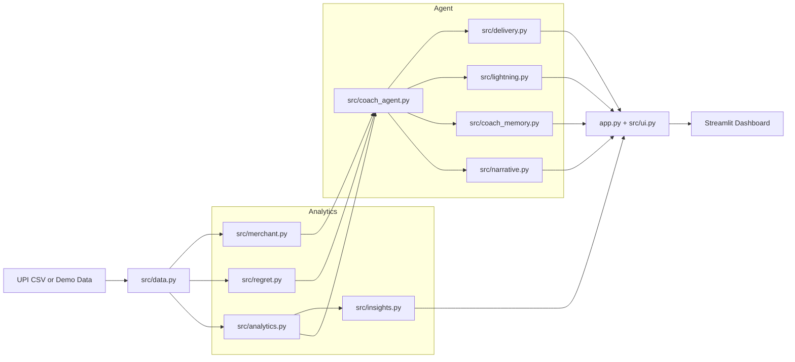
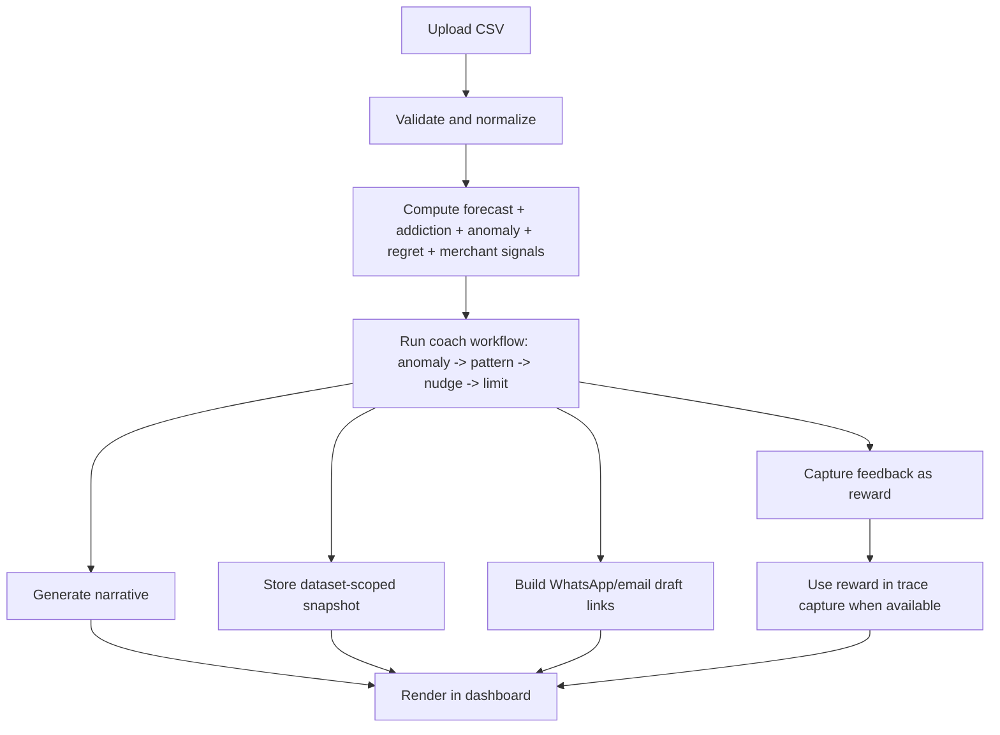

<div align="center">


[](#milestones)
[](#tech-stack)
[](#quickstart)
[](#system-architecture)
[](#tests-and-evaluation)
[](#license)
[](#project-backlog)

<strong>I built this because I couldn't track where my money actually went—so I turned my UPI data into a personal finance coach.</strong>

It started as a simple question: *Can I predict when I'll run out of money each month?* Then it became: *Can I understand my habits and get nudges before I overspend?* So I kept building.

**Where I am:** Milestone 3 of 8 | Mostly working, constantly improving | **[See BACKLOG.md](BACKLOG.md) for what's next**

</div>

## Contents

- [1) Product Snapshot](#1-product-snapshot)
- [Why Star This Repo](#why-star-this-repo)
- [2) Why It Is Different](#2-why-it-is-different)
- [Milestones & Roadmap](#milestones--roadmap)
- [3) System Architecture](#3-system-architecture)
- [4) End-to-End Data Flow](#4-end-to-end-data-flow)
- [5) Core Modules](#5-core-modules)
- [6) Quickstart](#6-quickstart)
- [7) Configuration](#7-configuration)
- [Sample Data and Demo Mode](#sample-data-and-demo-mode)
- [8) Testing and Evaluation](#8-testing-and-evaluation)
- [9) Tech Stack](#9-tech-stack)
- [10) Future Enhancements](#10-future-enhancements)
- [11) Repository Layout](#11-repository-layout)
- [12) License](#12-license)

## 1) Product Snapshot

UPI Mirror focuses on pre-failure behavioral detection.

- Input: UPI CSV or deterministic demo data
- Output: forecast, anomaly, regret, merchant, and coach intelligence
- Action Layer: daily nudge + suggested cap + delivery links
- Learning Signal: accept or dismiss nudge feedback as reward
- Traceability: reward-aware agent trace capture for later optimization

## Why I Built This

I'm a Data Science student who got tired of generic expense trackers. They just show you charts, not *why* you overspend.

So I built something that:
- **Predicts when I'll run out of money** (before it happens)
- **Finds my spending habits** (Food Delivery at 11 PM? Yeah, I see it)
- **Learns from my feedback** (rejected nudges don't repeat)
- **Explains its reasoning** (not a black box)

This is mostly for me to understand my own behavior. But if you're curious about AI, data science, or want to try it, go ahead.


## 2) Why It Is Different

Most tools answer only "what happened".
UPI Mirror answers "what is likely next" and "what should be done now".

| Capability | Typical Expense Tracker | UPI Mirror |
|---|---|---|
| Forecasting | historical totals | broke-date and projected month-end |
| Behavioral Layer | category split | habit intensity + anomaly routing + regret context |
| Intervention | none | daily nudge + weekly cap recommendation |
| Learning Loop | no user signal | accepted/dismissed feedback to reward |
| Actionability | passive dashboard | WhatsApp/email delivery drafts |

## What I'm Building (Roadmap)

**Right now:** M1–M3 working locally | M4 coming next

| Phase | What It Does | Status |
|-------|-------------|--------|
| **M1: The Math** | Broke-date forecasting, habit scoring, anomaly detection | ✅ Works |
| **M2: The Coach** | Takes signals → turns them into nudges you might actually listen to | ✅ Works |
| **M3: Real Data** | PDF parsing, explainability, better error handling | ✅ Works |
| **M4: What-if** | Sliders to see "if I cut 25%, when do I break even?" | 📋 Next |
| **M5: Learning** | Learns from feedback—nudges get better over time | 📋 Building |
| **M6–M8** | API, mobile, multi-user (someday, maybe) | 🔮 Future |

**[Full thinking is in BACKLOG.md →](BACKLOG.md)**

## 3) System Architecture

This view shows how data, analytics, agent logic, and UI are connected.



### Architecture Alignment (Layered View)

| Layer | Responsibility | Primary Files | Output |
|---|---|---|---|
| Data Input | Accept user CSV or demo stream | app.py, src/data.py | Clean transaction frame |
| Behavioral Analytics | Compute spend risk and behavior signals | src/analytics.py, src/regret.py, src/merchant.py | Forecast, anomaly, regret, merchant features |
| Decision Agent | Convert signals into intervention actions | src/coach_agent.py, src/narrative.py | Status, narrative, nudge, cap |
| Memory and Learning | Persist state and reward loops | src/coach_memory.py, src/lightning.py | Snapshot history, reward-aware traces |
| Action Delivery | Move insight into user channels | src/delivery.py, src/insights.py | WhatsApp/email drafts, summary exports |
| Experience Layer | Render full product in UI | app.py, src/ui.py | Multi-tab interactive dashboard |

### Component Contract Alignment

| Upstream | Contract | Downstream |
|---|---|---|
| src/data.py | normalized schema with datetime, amount, category, merchant, optional regret | analytics + regret + merchant modules |
| analytics + regret + merchant | feature bundle for risk and behavior context | coach_agent |
| coach_agent | intervention state (status, nudge, suggested cap, reward signal) | memory, delivery, streamlit presentation |
| coach_memory + user feedback | time-scoped user response history | lightning trace capture |
| lightning | reward-tagged trace metadata | optimization and evaluation workflows |

## 4) End-to-End Data Flow

This sequence shows how one upload becomes intervention-ready output.



## 5) Core Modules

Each module has one clear role in the overall product loop.

| Module | Role | Primary Value |
|---|---|---|
| Broke Date Predictor | projects month-end risk | prevents late-month surprises |
| Habit Scoring | category behavior intensity | detects repeat over-spend loops |
| Weekly Anomalies | week-level spike detection | flags early drift |
| Regret Analytics | regret by category/time/amount | adds behavioral meaning |
| Merchant Intelligence | late-night and regret-linked merchant view | reveals leakage sources |
| Coach Agent | anomaly -> pattern -> nudge -> cap workflow | daily intervention guidance |
| Memory Layer | upload-scoped snapshots | prevents cross-session contamination |
| Reward Layer | feedback to reward signal | real human learning input |
| Delivery Layer | prefilled WhatsApp/email drafts | moves action outside dashboard |
| Insight Layer | shareable cards and exports | portfolio and reporting ready |

## What's Interesting About It

- **Works without the internet** (no API needed unless you want Groq LLM suggestions)
- **Actually learns** (not just a recommendation box)
- **You can see *why* it made a decision** (not a black box)
- **Handles real messy data** (PDFs from Google Pay, Paytm, PhonePe)
- **25+ tests** so it doesn't break when I try new things
- **Parses your UPI PDFs** (no manual CSV conversion)
- **Tells you which signals mattered** (anomaly? regret? time of day?)

## 6) Quickstart

Get running in three simple steps.

1. Setup environment

```bash
python -m venv .venv
.venv\Scripts\activate
pip install -r requirements.txt
```

2. Run dashboard

```bash
streamlit run app.py
```

3. Run tests

```bash
pytest -q
```

### Using your real UPI data

**Option A: Upload CSV**
- Export UPI history as CSV with columns: `datetime, amount, category, merchant, regret (optional)`
- Upload in the **CSV Upload** tab

**Option B: Upload PDF Statement (New)**
- Download PDF from Google Pay, Paytm, or PhonePe
- System auto-extracts date, amount, merchant
- Select **PDF Statement** tab and upload
- Categories auto-inferred from merchant names using heuristics

## 7) Configuration

Use these optional settings only when needed.

Optional environment variables:

```bash
set GROQ_API_KEY=your_key_here
set COACH_EMAIL_TO=you@example.com
set COACH_WHATSAPP_NUMBER=919XXXXXXXXX
set COACH_MEMORY_DIR=.coach_memory
set COACH_MEMORY_PATH=
```

Notes:

- If GROQ_API_KEY is missing, narrative generation uses deterministic fallback.
- Default memory mode isolates snapshots using upload-scoped keys.

## Sample Data and Demo Mode

No CSV? The app still runs with deterministic demo transactions.

- Default mode without upload: built-in 90-day dataset from `src/data.py`
- Downloadable starter file: `sample_data/upi_sample_transactions.csv`
- Required columns for custom uploads: `datetime, amount, category, merchant`
- Optional column: `regret` (1-5)

How it works in demo mode:

1. Open app.
2. Use demo mode directly or download and upload the sample CSV.
3. Set budget/cutback sliders.
4. Review coach status, narrative, and delivery links.

## 8) Testing and Evaluation

Run tests before every PR to keep behavior stable.

Unit coverage includes:

- anomaly routing behavior
- anomaly status transitions
- limit suggestion logic
- reward scoring behavior
- narrative fallback path when Groq is not configured
- **NEW: comprehensive edge cases** (empty data, single transaction, missing columns)
- **NEW: addiction score calculation robustness**

Run:

```bash
pytest -q
```

### Model Quality Dashboard

A new **Model Quality** tab provides visibility into the combined AI+ML+DS pipeline:

- **Data Science Signal Coverage:** Percentage of behavioral features populated
- **Machine Learning Forecast Readiness:** Accuracy confidence and days-to-broke-date availability
- **AI Actionability:** Whether narrative and nudge outputs are usable
- **Learning Loop Strength:** Real user feedback sampled and feedback acceptance rate
- **Platform Score:** Weighted composite of all layers

### Decision Explainability

The **Coach Agent** tab now includes an expandable **📊 Decision Explainability** section that shows:

- Which signals fired (anomaly, repeat pattern, category regret, days left)
- Raw signal values
- Weight contribution to final decision
- Human-readable interpretation of each signal

This makes the black box transparent for judges and users.

## About the Project

UPI Mirror is built as a practical behavioral finance product, not a static chart dashboard.
It combines forecasting, behavioral diagnostics, intervention design, and user feedback loops so outputs are actionable, measurable, and demo-ready.

## 9) Tech Stack

This stack is chosen for speed, clarity, and practical delivery.

| Stack Area | Tools | Role in Product |
|---|---|---|
| Core Runtime | Python 3.11+ | Single-language rapid product iteration |
| App Interface | Streamlit, Plotly | Interactive dashboard and visual storytelling |
| Data and Modeling | Pandas, NumPy, scikit-learn | Reliable feature engineering and forecasting baseline |
| Agent Layer | LangGraph, langchain-groq (optional) | Deterministic coaching workflow + optional LLM narrative |
| Learning and Observability | Agent Lightning | Reward-aware trace capture for agent runs |
| Quality | pytest | Lightweight regression checks for core behavior |

### Tech Stack Alignment by Layer

| Layer | Tools | Why This Fit |
|---|---|---|
| Interface | Streamlit, Plotly | Fast interactive product surface with rich charting |
| Data Processing | Pandas, NumPy | Reliable tabular transformation and vectorized computation |
| Modeling | scikit-learn | Stable regression baseline for broke-date projection |
| Agent Orchestration | LangGraph | Explicit stateful graph for deterministic coach routing |
| Narrative Provider | langchain-groq (optional) | Low-friction LLM integration with fallback safety |
| Learning and Tracing | Agent Lightning | Reward-aware observability for intervention loops |
| Quality | pytest | Lightweight, repeatable verification for core logic |

### Runtime Alignment

| Concern | Current Choice | Rationale |
|---|---|---|
| Local Dev | Python venv + Streamlit run | Simple onboarding and reproducible setup |
| Optional AI Mode | GROQ_API_KEY gate | Predictable fallback when key is absent |
| Memory Isolation | upload-scoped keying | Prevents cross-dataset contamination |
| Delivery Channel | deep-link drafts first | Zero-cost action path before infra scaling |
| Verification | local pytest suite | Fast feedback loop before PR/merge |

## 10) Future Enhancements

These are the next high-impact upgrades.

- scheduled nudge delivery automation
- optional encryption-at-rest for memory snapshots
- scenario benchmark suite for coaching quality
- CI checks for tests and linting
- production hosting pack (Dockerfile + render.yaml + health checks)
- staging and production deployment workflow with release tags
- uptime monitoring and basic error alerting for hosted app
- production system architecture diagram (hosted runtime, monitoring, and logs)
- updated end-to-end data flow diagram for deployed mode and feedback loop lifecycle
- 🧩 architecture decision records for major model/agent tradeoffs

## 11) Repository Layout

The structure keeps analytics, agent logic, and UI concerns separated.

```text
UPI-Mirror/
|- app.py
|- requirements.txt
|- src/
|  |- analytics.py
|  |- coach_agent.py
|  |- coach_memory.py
|  |- data.py
|  |- delivery.py
|  |- insights.py
|  |- lightning.py
|  |- merchant.py
|  |- narrative.py
|  |- regret.py
|  |- ui.py
|- tests/
|  |- test_coach_agent_unit.py
|  |- test_narrative_fallback.py
|- docs/
|  |- DEMO_WALKTHROUGH.md
|  |- screenshots/
|     |- README.md
```

## 12) License

MIT license keeps usage simple for personal and commercial learning projects.

MIT

## Final Note

UPI Mirror is a practical end-to-end build: data pipeline, behavioral analytics, agent-driven intervention, and user feedback loop in one product.
If this helps your learning or inspires your own build, consider starring and forking the project.

---

<div align="center">

<strong>Built and maintained by @Yashaswini-V21</strong><br/>
UPI Mirror is an open project focused on predictive personal finance and behavior-driven intervention design.

If you like this work, please star this repository: https://github.com/Yashaswini-V21/UPI-Mirror

</div>
