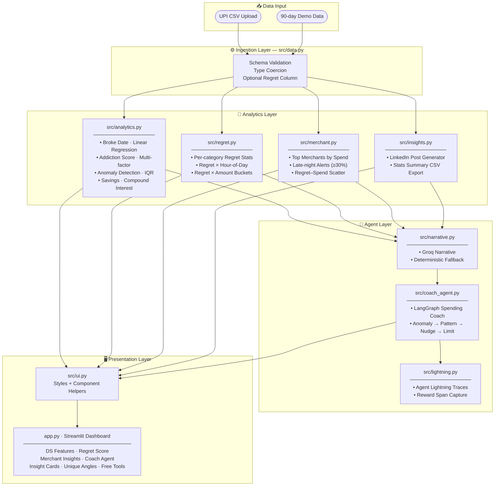

<div align="center">

# 💳 UPI Mirror

### Predictive Behavioural Finance Intelligence from UPI Data

> *Most expense tools report the past.*
> *UPI Mirror predicts risk, explains behaviour, and helps prevent repeat spending mistakes.*

[](https://python.org)
[](https://streamlit.io)
[](https://scikit-learn.org)
[](https://plotly.com)
[](LICENSE)
[](#)

**Built by [Yashaswini V](https://github.com/Yashaswini-V21)**

**Project Status:** In Progress (active development)

</div>

---

## Overview

**UPI Mirror** is an end-to-end behavioural finance analytics platform built entirely on free, open-source tools. It transforms raw UPI transaction exports into a predictive intelligence layer — surfacing spending forecasts, compulsive habit scores, anomaly alerts, and merchant-level behaviour patterns that no standard banking app provides.

The core insight: **the most impactful financial decisions are behavioural, not numerical.** UPI Mirror quantifies behaviour.

---

## What This Project Does

UPI Mirror turns a simple UPI transaction CSV into a complete behavioural intelligence report.

You can use it to:
- Predict when your monthly budget is likely to run out
- Identify categories that behave like spending addictions
- Catch abnormal weekly spikes before they become a pattern
- Measure post-purchase regret by category, amount, and hour
- Discover merchants driving late-night, high-regret spends
- Generate safe-to-share insight cards for resumes and LinkedIn

In short: it is not a passive expense tracker, it is an **early warning + behaviour correction system** for personal finance.

---

## What Makes It Unique

Most student finance tools either:
- Show static dashboards (pie charts, bar graphs)
- Require paid subscriptions or bank integrations
- Track what happened — never what's *about* to happen

UPI Mirror does something different across every layer:

| Layer | Standard Tools | UPI Mirror |
|-------|---------------|------------|
| **Prediction** | No forecasting | Linear regression → exact broke date |
| **Behaviour** | Category totals | Multi-factor addiction scoring per category |
| **Anomaly** | No alerts | IQR-based statistical spike detection |
| **Emotion** | No emotional layer | Regret scores correlated with time + amount |
| **Merchant** | Basic spend lists | Late-night pattern alerts, regret-spend scatter |
| **Shareability** | Export raw CSV | One-click LinkedIn post generator |
| **Access** | Paid APIs / bank login | Works on any UPI export, fully offline |

> *"Behavioural data science nobody has done this way."* — built on personal transaction data, not textbook datasets.

---

## Feature Set

| Module | Technique | Output |
|--------|-----------|--------|
| **Broke Date Predictor** | Linear regression on daily cumulative spend | "You will exhaust your budget by March 22 — 7 days from now" |
| **Spending Addiction Score** | Multi-factor scoring: frequency + consistency + amount growth + late-night share | 0–100 score per category with trend direction |
| **Weekly Anomaly Detection** | IQR-based outlier flagging | "This week's food spend is 2.8 σ above your baseline" |
| **Savings Simulator** | Compound interest projection | Cut one category by 30% + 6% FD → ₹18,400 in 12 months |
| **Category Regret Score** | Regret (1–5) correlated with amount, time-of-day | "Your Food Delivery regret score is 4.2/5 after 10 PM" |
| **Merchant Insights** | Late-night share analysis + regret-spend scatter | "Zomato: 68% of orders after 10 PM — ₹4,200 in late-night spend" |
| **Spending Coach Agent** | LangGraph workflow + Groq narrative + Agent Lightning trace hooks | Daily coach state: anomaly -> repeat pattern -> nudge -> limit |
| **Shareable Insight Cards** | Templated post generation + CSV export | One-click LinkedIn post with blurred numbers, safe to share publicly |

---

## System Architecture



### Data Flow (Step-by-Step)

1. User uploads UPI CSV (or uses auto-generated 90-day demo data).
2. `src/data.py` validates schema, parses datetimes, and standardizes types.
3. `src/analytics.py` computes broke-date forecast, addiction score, anomaly flags, and savings simulation.
4. `src/regret.py` computes regret intensity and time/amount relationships.
5. `src/merchant.py` computes merchant-level late-night and regret-linked spend patterns.
6. `src/narrative.py` builds a plain-English daily narrative using Groq when available and falls back to a deterministic template otherwise.
7. `src/coach_agent.py` runs a LangGraph coach workflow: anomaly detected → repeat pattern check → personalised nudge → limit suggestion.
8. `src/lightning.py` optionally records the coach run as Agent Lightning spans so future reward tuning has structured traces.
9. `app.py` + `src/ui.py` present all outputs in a multi-tab interactive dashboard.

---

## Project Structure

```
UPI-Mirror/
│
├── app.py                  # Streamlit entrypoint — all tabs and layout
├── requirements.txt        # Pinned dependencies
│
└── src/
    ├── data.py             # CSV loader, schema validator, demo data generator
    ├── analytics.py        # Broke-date predictor, addiction score, anomaly, savings
    ├── regret.py           # Regret analytics: per-category, hourly, amount correlation
    ├── merchant.py         # Merchant ranking, late-night alerts, regret ranking
    ├── narrative.py        # Groq narrative generation with deterministic fallback
    ├── coach_agent.py      # LangGraph spending coach workflow
    ├── lightning.py        # Agent Lightning trace capture for coach runs
    ├── insights.py         # LinkedIn card generator, summary CSV export
    └── ui.py               # CSS injection, hero card, shared UI components
```

---

## Quickstart (Professional Setup)

### 1. Prerequisites

- Python 3.11 or above
- Git
- Terminal / PowerShell

### 2. Clone Repository

```bash
git clone https://github.com/Yashaswini-V21/UPI-Mirror.git
cd UPI-Mirror
```

### 3. Create and Activate Virtual Environment

```bash
# Windows
python -m venv .venv
.venv\Scripts\activate

# macOS / Linux
python -m venv .venv
source .venv/bin/activate
```

### 4. Install Dependencies

```bash
pip install -r requirements.txt
```

### 5. Launch Dashboard

```bash
streamlit run app.py
```

### 5.1 Optional AI Environment Variables

```bash
# Groq narrative provider
set GROQ_API_KEY=your_groq_key_here
```

If `GROQ_API_KEY` is missing, the Spending Coach still runs using a deterministic narrative fallback.

### 6. Open in Browser

Visit [http://localhost:8501](http://localhost:8501) — demo data loads automatically. No CSV required to explore the full feature set.

---

## CSV Schema

Bring your own UPI export. The only required columns are the first four:

```csv
datetime,amount,category,merchant,regret
2026-03-01 20:15:00,320.0,Food Delivery,Zomato,4
2026-03-02 09:30:00,180.0,Cafe,Blue Tokai,2
2026-03-03 11:00:00,640.0,Groceries,Blinkit,1
```

| Column | Format | Required |
|--------|--------|----------|
| `datetime` | `YYYY-MM-DD HH:MM:SS` | ✅ |
| `amount` | `float` — amount in Rs. | ✅ |
| `category` | `string` | ✅ |
| `merchant` | `string` | ✅ |
| `regret` | `int` 1–5 | ⬜ optional |

---

## Tech Stack

| Tool | Version | Role |
|------|---------|------|
| **Python** | 3.11+ | Core runtime |
| **Pandas** | 2.3 | Data wrangling, aggregations, time-series resampling |
| **Scikit-learn** | 1.8 | Linear regression for broke-date prediction |
| **Streamlit** | 1.55 | Interactive web dashboard with real-time sidebar controls |
| **Plotly** | 6.0 | Line, bar, scatter, area, bubble charts |
| **NumPy** | 2.0 | Numerical computation and array operations |
| **LangGraph** | 0.2+ | Stateful spending coach workflow |
| **Groq via langchain-groq** | 0.2+ | Plain-English spending narrative generation |
| **Agent Lightning** | 0.3+ | Trace capture and future reward optimization loop |

**Zero paid APIs. Zero external databases. Runs fully offline on your own data.**

Groq is optional. Without an API key, the coach falls back to a local rule-based narrative. Agent Lightning is also optional at runtime; it is used to capture coach traces for future optimization rather than to power the dashboard itself.

---

## 8-Issue Delivery Plan

If you want to build this cleanly through your own GitHub workflow, split it into eight small issues and merge them one by one.

1. **Issue 1 — Groq Narrative Layer**
    Add `src/narrative.py`, environment-variable handling, and deterministic fallback text.
2. **Issue 2 — LangGraph Coach State**
    Define coach state, node functions, and the anomaly → pattern → nudge → limit graph.
3. **Issue 3 — Streamlit Coach Tab**
    Add a new dashboard tab showing coach status, narrative, nudge, and limit suggestion.
4. **Issue 4 — Daily Memory / Persistence**
    Persist coach snapshots across runs instead of keeping them only in the current app session.
5. **Issue 5 — User Feedback Rewards**
    Capture whether the user followed a nudge and convert that into a reward signal.
6. **Issue 6 — Agent Lightning Integration**
    Record LangGraph coach runs as spans/rewards so the agent can later be optimized with trace data.
7. **Issue 7 — Tests and Evaluation**
    Add unit tests for anomaly routing, fallback narratives, limit suggestions, and reward scoring.
8. **Issue 8 — README, Demo, and Polish**
    Finalize docs, screenshots, sample walkthrough, and issue templates for contributors.

### Recommended GitHub Workflow

1. Create one GitHub issue per scope above.
2. Create a branch from `main` for each issue, for example `feat/issue-2-langgraph-coach`.
3. Build only that slice, open a PR, and reference the issue in the PR description.
4. Review the PR against one acceptance checklist, not the whole product.
5. Merge after validation, then open the next branch from updated `main`.

That keeps the project explainable in interviews and easier to demo: every issue becomes one story, one PR, one merge.

---

## Future Enhancements

| Priority | Feature | Why |
|----------|---------|-----|
| 🔴 High | **WhatsApp / Email nudge** when anomaly or high-regret week detected | Closes the loop from insight → behaviour change |
| 🔴 High | **Per-merchant weekly trend drill-down** | Deeper pattern analysis per merchant |
| 🟡 Medium | **Dark / light theme toggle** | Accessibility + demo-friendly |
| 🟡 Medium | **Isolation Forest anomaly detection** | More robust than IQR on skewed spend distributions |
| 🟡 Medium | **GPT-powered spend narrative** | Plain-English summary of the month's behavioural patterns |
| 🟢 Low | **Multi-month comparison view** | Track whether habits are improving over time |
| 🟢 Low | **PhonePe / Google Pay CSV auto-parser** | Remove manual formatting step for real UPI exports |
| 🟢 Low | **Budget goal setting with progress tracker** | Turn insight into active financial planning |

---

## Practical Impact

UPI Mirror is designed to support real spending decisions, not just reporting.

- **Before overspending:** broke-date prediction warns when current pace is unsafe
- **During the month:** anomaly alerts catch unusual jumps early
- **After transactions:** regret analysis identifies repeat triggers
- **At merchant level:** late-night and high-regret patterns reveal where leakage happens
- **For communication:** shareable cards convert analysis into resume/LinkedIn-ready proof

### How This Is Different

- It is behaviour-first, not category-chart-first
- It gives forward-looking signals, not only historical summaries
- It combines forecasting, anomaly detection, regret analytics, and communication in one app
- It runs fully offline on plain CSV input with no paid APIs

---

<div align="center">

Built by **[Yashaswini V](https://github.com/Yashaswini-V21)**

*Star the repo ⭐ if this helped you think differently about your own spending.*

</div>
