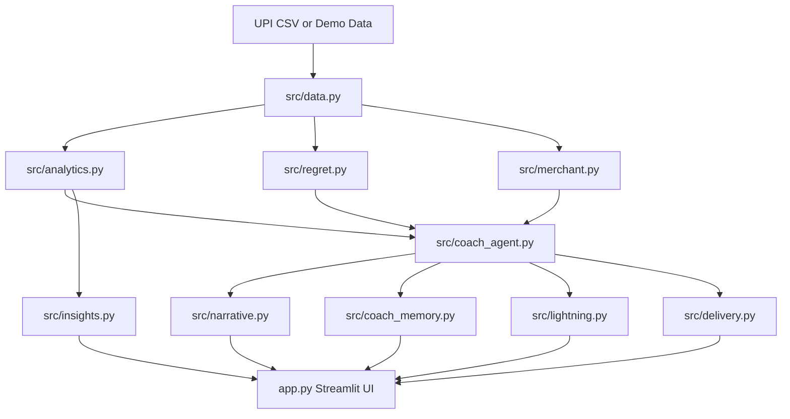

# UPI Mirror

Behavioral finance intelligence from UPI transaction data.

UPI Mirror goes beyond expense tracking. It predicts risk, explains spending behavior, and provides intervention nudges you can act on immediately.

## Why This Project

Most finance apps show where money went.
UPI Mirror focuses on what to do next:

- Forecast budget runway and likely broke date
- Detect weekly spend anomalies early
- Identify repeat habit categories with addiction-style scoring
- Surface regret and late-night merchant behavior signals
- Generate a daily coach nudge with feedback loops

## Core Features

| Area | What it does | Value |
|---|---|---|
| Broke Date Prediction | Forecasts projected month-end spend and risk date | Early warning before overspending |
| Habit Scoring | Computes category-level behavioral scores | Finds repeat spend patterns |
| Weekly Anomalies | Flags unusual week-level spikes | Highlights unusual behavior fast |
| Regret Analytics | Correlates regret with category, amount, and hour | Adds behavioral context to spend |
| Merchant Insights | Tracks late-night and regret-linked merchants | Shows leakage points clearly |
| Coach Agent | LangGraph workflow for anomaly -> pattern -> nudge -> cap | Gives a daily intervention |
| Coach Memory | Dataset-scoped snapshot history | Prevents cross-upload data mixing |
| Feedback Rewards | Captures accepted/dismissed nudge feedback | Converts user signal into reward |
| Delivery Links | Creates WhatsApp and email drafts from the live nudge | Makes coach action shareable outside app |
| Insight Cards | Generates social and summary outputs | Easy sharing and reporting |

## Architecture



## Project Structure

```text
UPI-Mirror/
|- app.py
|- requirements.txt
|- src/
|  |- analytics.py
|  |- coach_agent.py
|  |- coach_memory.py
|  |- data.py
|  |- delivery.py
|  |- insights.py
|  |- lightning.py
|  |- merchant.py
|  |- narrative.py
|  |- regret.py
|  |- ui.py
|- tests/
|  |- test_coach_agent_unit.py
|  |- test_narrative_fallback.py
|- docs/
|  |- DEMO_WALKTHROUGH.md
|  |- screenshots/
|     |- README.md
```

## Quickstart

### 1. Setup

```bash
python -m venv .venv
.venv\Scripts\activate
pip install -r requirements.txt
```

### 2. Run App

```bash
streamlit run app.py
```

### 3. Run Tests

```bash
pytest -q
```

## Optional Environment Variables

```bash
# AI narrative provider
set GROQ_API_KEY=your_key_here

# Prefill delivery targets
set COACH_EMAIL_TO=your@email.com
set COACH_WHATSAPP_NUMBER=919XXXXXXXXX

# Memory storage config (optional)
set COACH_MEMORY_DIR=.coach_memory
set COACH_MEMORY_PATH=
```

Notes:

- If GROQ_API_KEY is not set, narrative generation falls back to a deterministic local template.
- Memory is isolated by upload hash when using the default memory directory mode.

## Testing and Evaluation

Current unit tests cover:

- Anomaly routing decisions
- Anomaly status behavior
- Limit suggestion logic
- Reward scoring logic
- Narrative fallback behavior when Groq is unavailable

Command:

```bash
pytest -q
```

## Demo Assets

- Demo walkthrough: docs/DEMO_WALKTHROUGH.md
- Screenshot guide: docs/screenshots/README.md

Recommended screenshot set:

- Dashboard overview
- Coach Agent tab
- Regret tab
- Merchant tab
- Delivery action links

## Tech Stack

- Python 3.11+
- Streamlit
- Pandas
- NumPy
- scikit-learn
- Plotly
- LangGraph
- langchain-groq
- Agent Lightning
- pytest

## Product Roadmap

- Scheduled auto-send delivery for nudges
- Optional encryption-at-rest for memory snapshots
- Scenario-based coaching quality benchmarks
- CI checks for tests and linting

## License

MIT
