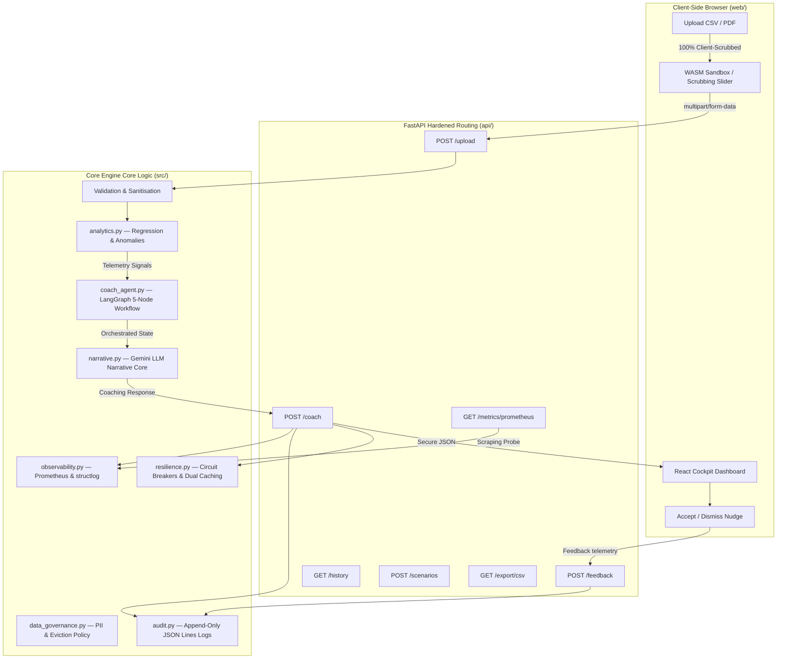

<div align="center">


[](https://python.org)
[](https://fastapi.tiangolo.com)
[](https://reactjs.org)
[](https://langchain-ai.github.io/langgraph/)
[](LICENSE)
[](https://github.com)

<p align="center">
  <strong>A production-grade, highly interactive behavioral finance intelligence platform. Kira decodes local bank statements, scrubs transaction identifiers client-side inside WebAssembly sandboxes, maps metrics with LangGraph supervisor logic, and routes actionable financial nudges—all managed via a hardened FastAPI backend and a futuristic React split-screen cockpit interface.</strong>
</p>

</div>

---

## 📖 Table of Contents

1. [Product Overview](#1-product-overview)
2. [Interactive Cyber Command Center Cockpit (Upgrades Spotlight)](#2-interactive-cyber-command-center-cockpit-upgrades-spotlight)
3. [Key Differentiators](#3-key-differentiators)
4. [System Architecture & Pipelines](#4-system-architecture--pipelines)
5. [Repository Structure](#5-repository-structure)
6. [Developer Quickstart](#6-developer-quickstart)
7. [API Reference & Telemetry Routes](#7-api-reference--telemetry-routes)
8. [Backend Core Modules](#8-backend-core-modules)
9. [Security Hardening & Protection controls](#9-security-hardening--protection-controls)
10. [Data Governance & PII Protection](#10-data-governance--pii-protection)
11. [Testing & Quality Assurance](#11-testing--quality-assurance)
12. [Deployment Framework](#12-deployment-framework)

---

## 1) Product Overview

Kira-AI addresses **pre-failure behavioral detection**—detecting spending leaks, discretionary Runway deterioration, and category anomalies *before* the balance hits zero.

It ingests messy transaction history (Google Pay, Paytm, PhonePe exports, or direct parsed bank PDFs) and outputs actionable, rule-constrained financial coaching signals:

| Capability | Technical Output | Behavioral Impact |
|---|---|---|
| **Broke-Date Projection** | Linear regression on cumulative burn | Foresees cash depletion dates with confidence bands |
| **Habit Scoring** | 0–100 category index meters | Flags late-night impulse buys and transaction frequencies |
| **IQR Spikes Detection** | Upper-fence anomaly alerts | Isolates major discretionary spikes instantly |
| **Coaching Interventions** | Gemini-powered local rule-bound nudges | Prompts actionable targets (caps, durations, and steps) |
| **Feedback Loop** | Accepted / dismissed reward telemetry | Optimises narrative alignment for personalized retention |
| **What-If Scenarios** | Parameterized budget simulators | Gathers metrics showing days-gained by category reductions |

---

## 2) Interactive Cyber Command Center Cockpit (Upgrades Spotlight)

Version 3.0 introduces a state-of-the-art **Split-Screen Cyber Command Center** Hero experience in the React client, focusing on real-time interactive de-identification simulations:

```
+------------------------------------------+    Flying Particle Flow    +------------------------------------------+
|     WASM Sandbox Privacy Core Dock       | -------------------------> |        CommandCenterDeck Cockpit         |
| [PDF Bay] [CSV Bay] [SMS Bay] (Tabbed)   |    (Curved Laser Beam)     | [ Target Sweeper HUD ]                   |
| - Memory Buffers: Raw vs. Scrubbed Text  |                            | - Live Cryptographic Activity Logs       |
| - Slider: De-identification intensity    |                            | - Manual Security Scan sweep line        |
+------------------------------------------+                            +------------------------------------------+
```

### 💎 Interactive Upgrades List

*   **Left Column: WASM Sandbox Privacy Core Dock**
    *   **Tabbed Ingestion Bays**: Toggle between three local statement mockups: `📄 PDF Statements`, `📊 CSV Ledgers`, and `💬 SMS Alerts`.
    *   **Side-by-Side In-Memory Buffers**: Showcases raw exposed data variables in a red glowing terminal (`[IN MEMORY RAW BUFFER]`) vs. scrubbed data keys in a teal glowing terminal (`[SCRUBBED LOCAL BUFFER]`).
    *   **De-identification Depth Slider**: A responsive slider allowing users to scrub identifiers in real time between `0% (Minimal)`, `50% (Shielded)`, and `100% (Absolute Secure)`. Moving the slider dynamically replaces names, accounts, and amounts with asterisks in the live buffer.
    *   **WASM Telemetry Stats**: Outputs local parsing latency metrics (`< 0.4ms`), volatile context retention rules (`0ms // RAM`), and anonymity indexes.
    *   **Curved Flying Packet Pulse**: Clicking `INGEST & RUN DE-IDENTIFICATION` triggers a glowing Bezier keyframe particle packet that shoots across the columns into the right cockpit deck.
*   **Right Column: CommandCenterDeck Cockpit**
    *   **Futuristic HUD Target rings**: Concert-grade dual concentric SVG lines rotating in opposite directions.
    *   **Manual Security Sweep**: Triggering `[ RUN SECURITY CHECK ]` sweeps a green neon laser scanner across the 3D-perspective deck, runs local SHA-256 integrity checks, and updates volatile cockpit traces.
    *   **Telemetry Logs**: Tickers real-time system steps (`INGEST`, `DECODE`, `REDISP`, `SECURE`, `ROUTE`, `DISPATCH`) synchronized with the left column's active state.
*   **Client-Side UPI Decoder Sandbox (`DecoderSandbox`)**
    *   Replaces generic text blocks with a local transaction parser. Users select real transaction samples (Swiggy, Uber, Netflix) and watch a client-side regex anonymizer scrub merchant details and cards.
*   **Digg-Style Architecture Newsfeed (`HowItWorks` component)**
    *   A content-aggregator newsfeed replacing traditional static vertical columns. 
    *   Includes interactive **upvote counters** with custom Framer Motion spring actions, comments counts, author channels (`in/local-privacy-core`), and inline **telemetry code expanders** for each node.
*   **Blurred Empty-State Coach Console (`CoachTab.tsx`)**
    *   Mitigates long, static skeleton loaders. When no active statement session is loaded, it provides a blurred preview dashboard covered by a glassmorphic **"⚡ Load Sample Coach Session"** CTA that directly populates the Zustand store with realistic demo metrics.

---

## 3) Key Differentiators

Kira-AI is built to provide actionable behavioral interventions rather than static retrospective graphs:

| Feature | Conventional Finance Trackers | **Kira-AI** |
|---|---|---|
| **Privacy Model** | Cloud ingestion of raw names & balances | **Client-side WASM de-identification before routing** |
| **Forecasting** | Simple historical monthly averages | **Cumulative linear regression broke-date predictions** |
| **Interventions** | Passive, static notifications | **Dynamic spend caps + contextual narrative coaching** |
| **LLM Reliability** | Prone to hallucinations | **Circuit-breaker protected, template-backed LLM narratives** |
| **Data Governance** | Permanent cloud logs of accounts | **90-Day strict auto-purge retention sweeps** |

---

## 4) System Architecture & Pipelines

Kira-AI uses a decoupled, hardened architecture. Raw client statements are scrubbed locally in the browser before reaching backend APIs.



### The 5-Node LangGraph Coach Pipeline

The coach workflow is compiled at import time and executes asynchronously:

```
[START] ➔ anomaly_check ➔ pattern_analysis ➔ nudge_generation ➔ cap_recommendation ➔ confidence_scoring ➔ [END]
```

*   **`anomaly_check`**: Assesses weekly IQR metrics, writing `anomaly_detected` and calculated spike weights.
*   **`pattern_analysis`**: Evaluates days-left runway variables against habit scores to assign status states.
*   **`nudge_generation`**: Connects status indexes to draft rule-bound coaching templates or LLM prompts.
*   **`cap_recommendation`**: Formulates recommended spending caps for the primary overspend category.
*   **`confidence_scoring`**: Calculates overall output validation scores using data density and feedback history.

---

## 5) Repository Structure

```text
Kira-AI/
│
├── api/                          # FastAPI Web Routing Layer
│   ├── __init__.py
│   ├── main.py                   # App factory, OWASP headers, CORS, metrics, rate limits
│   ├── schemas.py                # Pydantic v2 validation models
│   └── security.py               # constant-time Auth digests, magic-bytes checks
│
├── src/                          # Core Behavioral & Analytics Logic
│   ├── __init__.py
│   ├── analytics.py              # Linear regression Broke-Dates, IQR anomalies, Addiction meters
│   ├── audit.py                  # Immutable JSON-Lines append-only logger
│   ├── coach_agent.py            # compiled stateful 5-node LangGraph pipeline
│   ├── coach_memory.py           # Snapshot read/writes for session persistence
│   ├── data.py                   # Parsing matrices and transaction scrubbers
│   ├── data_governance.py        # PII SHA-256 masking, GDPR-compliant retention sweeps
│   ├── delivery.py               # WhatsApp and Email dispatch integrations
│   ├── evaluation.py             # Accuracy evaluation (Mean Absolute Error, signal bounds)
│   ├── explainability.py         # Human-readable diagnostic explanation builders
│   ├── narrative.py              # Gemini LLM driver with pybreaker and fallback maps
│   ├── observability.py          # Prometheus counters/gauges and structlog setup
│   ├── pdf_parser.py             # Local UPI PDF parsing (regex grids)
│   └── resilience.py             # pybreaker Circuit Breakers and TTL caching
│
├── web/                          # React + Vite + TypeScript frontend
│   ├── src/
│   │   ├── components/           # Cockpit HUD components (LandingScreen, WasmDock, CommandCenterDeck)
│   │   ├── store/                # Zustand global store (session tracking, demo loaders)
│   │   └── styles.css            # Cyber CSS tokens, grids, neon animations
│   ├── package.json
│   └── vite.config.ts
│
├── tests/                        # Comprehensive Python Test Suite
│   ├── test_api.py               # FastAPI integration checks
│   ├── test_coach_agent_unit.py  # LangGraph node assertions
│   └── test_narrative_fallback.py# Gemini circuit-breaker mock assertions
│
├── sample_data/                  # Mock statements for simulator usage
├── .env.example                  # Environment defaults template
├── Dockerfile                    # Pinned API container manifest
├── Makefile                      # Make scripts and developer task runners
└── requirements.txt              # Pinned Python package dependencies
```

---

## 6) Developer Quickstart

### Prerequisites

*   **Python**: `3.11+`
*   **Node.js**: `18.0+`
*   **Package Managers**: `pip` and `npm`

### 🛠 Manual Local Launch

#### Step 1: Clone & Configure

```bash
git clone https://github.com/your-org/Kira-AI.git
cd Kira-AI
cp .env.example .env
# Edit .env and supply GEMINI_API_KEY and KIRA_AI_API_KEY
```

#### Step 2: Set up Backend API

```bash
# Create virtual environment
python -m venv .venv
source .venv/bin/activate # On Windows: .venv\Scripts\activate

# Install requirements
pip install -r requirements.txt

# Launch FastAPI live reload on port 8000
uvicorn api.main:app --reload --port 8000
```

> [!NOTE]
> Backend interactive docs are available at [http://localhost:8000/docs](http://localhost:8000/docs) in development mode.

#### Step 3: Set up React Frontend

```bash
cd web
npm install
npm run dev
```

> [!TIP]
> The dev server launches at [http://localhost:5173](http://localhost:5173).

---

### ⚡ Automated Launch (Make)

A `Makefile` is configured at the root to automate environment orchestration:

```bash
make install        # Bootstraps Python and sets up requirements
make run-api        # Spins up FastAPI on Port 8000
make run-web        # Spins up Vite frontend on Port 5173
make test           # Runs complete pytest suite with full coverage reporting
make lint           # Performs black, flake8, and mypy quality checks
make audit          # Checks Python packages for known vulnerabilities (bandit & pip-audit)
```

---

## 7) API Reference & Telemetry Routes

> [!IMPORTANT]
> All REST API calls require Bearer authentication headers containing a cryptographically secure token matching the backend’s active `KIRA_AI_API_KEY`.

### Authentication Header

```http
Authorization: Bearer <KIRA_AI_API_KEY>
```

### 1. `POST /upload`
Ingests, validates, and stores a raw or client-masked transaction ledger.
*   **Payload Format**: `multipart/form-data`
*   **Accepted Files**: `.csv`, `.pdf`, `.txt` (hard-capped at ≤ 5 MB and 10,000 transaction rows).
*   **Response**:
```json
{
  "upload_id": "kira_1716923456789",
  "rows": 312,
  "date_range": { "start": "2026-05-01", "end": "2026-05-31" },
  "categories": ["Food", "Transit", "Subscriptions"],
  "parsed_format": "csv"
}
```

### 2. `POST /coach?upload_id=…&budget=…`
Executes the stateful 5-node LangGraph pipeline. Responses are cached locally to minimize latency.
*   **Query Parameters**: `upload_id` (string), `budget` (float)
*   **Response**:
```json
{
  "status": "watch",
  "days_left": 12,
  "narrative": "Food spending has spiked to ₹1,420/day with 12 days remaining...",
  "nudge": "UPI alert triggered: Limit Swiggy spending to recover ₹2,420.",
  "suggested_cap": 3600.0,
  "confidence_score": 0.94,
  "urgency": "medium",
  "signals": {
    "anomaly_detected": true,
    "habit_score": 78.5,
    "top_category": "Food"
  }
}
```

### 3. `GET /metrics/prometheus`
Exposes production-ready unauthenticated Prometheus scraping data for system telemetry.
*   **Authentication**: None (unauthenticated to support automated scrapers).
*   **Format**: Plaintext matching standard Prometheus line formats.
```prometheus
# HELP kira_http_requests_total Total number of HTTP requests
# TYPE kira_http_requests_total counter
kira_http_requests_total{method="POST",path="/coach",status_code="200"} 42
# HELP kira_active_sessions Active volatile statements in context
# TYPE kira_active_sessions gauge
kira_active_sessions 3
```

---

## 8) Backend Core Modules

*   **`src/analytics.py` (Forecasting Model)**
    *   `predict_broke_date()`: Computes cumulative daily spends and performs linear regression models. Projects base-case, best-case, and worst-case runway bands.
    *   `compute_addiction_scores()`: Ranks spending habits on a scale of `0–100` using frequency, spend ratios, week-over-week consistency, and late-night hour indexes.
*   **`src/resilience.py` (Resilience & Caching)**
    *   Maintains double-tiered TTL caching: `CoachResultCache` (1-hour cache bucketed to the nearest ₹100) and `NarrativeCache` (24-hour cache for expensive LLM narratives).
    *   `gemini_breaker`: A circuit breaker configured with `pybreaker` that trips open for 60 seconds after 5 consecutive LLM errors, automatically routing requests to deterministic template generators.
*   **`src/data_governance.py` (Data Eviction)**
    *   Runs strict auto-eviction routines on startup, purging local statement directories older than `DATA_RETENTION_DAYS` (default `90`).
    *   Enforces hard limits on memory footprint by evicting the oldest sessions when system totals cross `MAX_SESSIONS` (default `10,000`).

---

## 9) Security Hardening & Protection Controls

Kira-AI is engineered around a comprehensive defense-in-depth model:

| Control Area | Security Action | Mitigation |
|---|---|---|
| **Constant-Time Verification** | Uses `hmac.compare_digest` to validate tokens | Eliminates side-channel timing analysis attacks |
| **API Key Constraints** | Validates minimum entropy (≥ 32 chars) at startup | Blocks deployment of weak or default configurations |
| **CSV Injection Shielding** | Sanitizes all cells starting with `=`, `@`, `+`, `-`, or tabs | Prevents CSV injection attacks |
| **Upload Guardrails** | Validates `%PDF` magic bytes and isolates execution in RAM | Blocks malicious executables disguised as statements |
| **Hardened HTTP Headers** | Injects strict CSP, `X-Frame-Options: DENY`, and HSTS | Stops clickjacking and cross-site scripting |
| **Rate Limiters** | Limits upload endpoints (5/min) and coach engines (10/min) | Prevents denial-of-service and brute force requests |

---

## 10) Data Governance & PII Protection

Kira-AI enforces a strict **zero-retention, client-first data pipeline**:

*   **Data Masking**: All merchant name strings are converted to SHA-256 hashes (`12-char` prefixes) in backend logs and CSV exports to prevent transaction tracing.
*   **Log Redaction**: Transaction amounts and raw UPI strings are **never written** to persistent logs.
*   **ID Masking**: System upload IDs are obfuscated in active logs using custom masking filters (e.g. `kira_171692***`).
*   **GDPR Alignment**: Emits startup warnings if data retention periods are configured longer than a year (`DATA_RETENTION_DAYS > 365`).

---

## 11) Testing & Quality Assurance

Quality assurance is verified using a layered pytest suite:

```bash
# Run complete test suite and output missing coverage blocks
python -m pytest tests/ -v --cov=src --cov=api --cov-report=term-missing

# Run node unit tests within LangGraph workflows
pytest tests/test_coach_agent_unit.py -v

# Run fallback simulation tests (opening Gemini circuit breakers)
pytest tests/test_narrative_fallback.py -v
```

### Code Quality & Continuous Integration (CI/CD)

The codebase is hardened with comprehensive continuous integration pipelines for both **GitHub Actions** and **GitLab CI/CD**.

#### 🐙 GitHub Actions Pipelines
Managed via `.github/workflows/`:
- **Backend Tests & Quality Gates** (`backend-tests.yml`): Runs pytest (requiring &ge; 70% coverage), runs MyPy type checking, and Flake8 linting.
- **Frontend Quality Gates** (`frontend-tests.yml`): Validates TypeScript (`tsc --noEmit`) and ESLint.
- **Security Scan** (`security-scan.yml`): Scans for security vulnerabilities using Bandit, audits Python dependencies with pip-audit, and checks for hardcoded secrets.

#### 🦊 GitLab CI/CD Pipelines
Managed via `.gitlab-ci.yml`:
- **`test` Stage**: Runs unit and API integration tests (enforcing a 70% coverage floor via `--cov-fail-under`), and runs frontend type checking and builds.
- **`lint` Stage**: Runs Python code checkers (Black, Flake8, MyPy) and frontend linting.
- **`security` Stage**: Validates Python packages against known CVEs (pip-audit), scans Python logic (Bandit), and audits npm packages for security risks (npm audit).
- **`build` Stage**: Builds production-ready Docker containers (`Dockerfile`).
- **`deploy` Stage**: Automates production deployment via webhooks to the environment platform.

#### 🛠 Local Quality Check Hooks
You can run standard checks locally prior to committing:
```bash
make lint       # Executes black (max line 100), flake8, and strict mypy checks
make audit      # Checks packages for vulnerabilities and scans code with Bandit
```

---

## 12) Deployment Framework

### Docker Container Ingestion

A lightweight production Dockerfile is included:

```bash
# Build the production container
docker build -t kira-ai-prod .

# Run the container matching your active environment file
docker run -d -p 8000:8000 --env-file .env kira-ai-prod
```

### Vercel / Render Deployment Manifests

*   **Backend (Render)**: Manifested inside `render.yaml` for zero-downtime, declarative backend environments.
*   **Frontend (Vercel)**: Configured inside `vercel.json` as a single-page app (SPA) router targeting Vite production static assets.

---

<div align="center">
<sub>Engineered with care using FastAPI, LangGraph, Gemini API, React, and Prometheus Telemetry.</sub>
</div>
